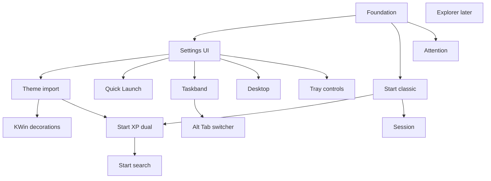

# QuickXP shell roadmap (epics and features)

Canonical copy for the repo: [docs/ROADMAP.md](../../docs/ROADMAP.md). Update both when the roadmap changes.

Scope is the desktop shell (taskbar, Start, tray, desktop, session, theme import). Explorer folder windows are a later epic.

Vista and 7 are presentation policy on shared backends, not a fork. Theme/shell key: `generation: "xp" | "vista" | "win7"` in [src/themes/luna/theme.json](src/themes/luna/theme.json) / [src/themes/aero/theme.json](src/themes/aero/theme.json). [src/Theme.qml](src/Theme.qml) already merges arbitrary JSON groups and live-reloads `theme.json`.

## Already implemented (baseline)

- Themes with live reload; Luna sprites; Aero color-only stub.
- Bottom taskbar, Start button chrome (no menu), task buttons, paging, system menu, KWin window peek, dual window backends, tray with hide-inactive, clock.
- **Offline theme tooling (CLI only):**
  - [src/scripts/extract_xp_theme.py](src/scripts/extract_xp_theme.py) — PE resource dump from `.msstyles` / `Shellstyle.dll` (bitmaps + TEXTFILE/UIFILE/strings).
  - [scripts/convert-theme-bmps.py](scripts/convert-theme-bmps.py) — BMP → PNG with alpha / color-key from theme INI.
  - Hand-authored [src/themes/luna/theme.json](src/themes/luna/theme.json) mapping logical keys → image paths (not generated by the scripts today).

Key shell files: [src/TaskBar.qml](src/TaskBar.qml), [src/TaskList.qml](src/TaskList.qml), [src/Tray.qml](src/Tray.qml), [src/Theme.qml](src/Theme.qml), [src/kwin/tasks.js](src/kwin/tasks.js), [src/TasksBridge.py](src/TasksBridge.py).

---

## Epic 0 — Shell foundation

Shared seams so later epics do not hardcode XP-only assumptions.

- **Generation / layout policy** — Theme or shell key selects classic vs XP vs Vista/7 presentation for Start, Quick Launch placement, and grouping rules.
- **Config store** — Persistent JSON (or similar) for shell options: active theme slug, taskbar edge/auto-hide/lock, **taskbar height (px / “row” unit)**, **group buttons** (bool), **icon-only buttons** (bool; independent of grouping), Quick Launch on/off, Start layout (classic vs XP), notification prefs, “match window borders”, tray control visibility, etc. Live-bindable from QML; written on Apply or on change per field.
- **Start popup host** — Open/close from Start button, dismiss on outside click / Esc, position above Start.
- **App catalog adapter** — Resolve `.desktop` entries, icons, launch; shared by classic Start, XP pins, and later search.
- **Installed theme registry** — List of themes under `themes/` (name, generation, path); `Theme.name` switch without restart.
- **Open Settings API** — `Settings.open(tab)` so the Start-button menu, taskbar context menu, and desktop Properties can jump to a specific tab.

---

## Epic S — Central Settings window

One tabbed configuration UI for the shell (XP-styled dialog chrome). This is the home for theme import, taskbar options, desktop options, and later panels — not separate one-off dialogs.

### Shell

- **Window host** — Panel or floating window with OK / Cancel / Apply (XP Display Properties pattern): Cancel reverts draft; Apply writes config + side effects (theme, KWin sync).
- **Tab bar** — Extensible list of pages; deep-link via `Settings.open("theme")` etc.
- **Draft vs applied** — Edits go into a draft model until Apply/OK so Preview can show theme changes safely.
- **Entry points** — **Primary: right-click the Start button** → context menu with Open Settings / Properties (opens Settings; default tab Theme or last-used). Also: empty-taskbar context menu → Properties; desktop context menu → Properties; optional Start menu Control Panel stub later.

### Tabs (initial set)

- **Theme** — Installed themes list, preview (taskbar + Start + sample titlebar), color scheme, “Match window borders”, **Import…** (browse `.msstyles` / `.theme` / folder → Epic T wizard inline or as a sub-dialog), Delete theme. Primary place to load an msstyle.
- **Taskbar** — Lock, auto-hide, edge (bottom first; other edges when Epic 5 supports them), **Group similar taskbar buttons** and **Icons only** (independent; combinable), optional presets **“Windows XP taskbar”** (labels + list groups) vs **“Icon taskbar with previews”** (icons + thumbnail strip), **Taskbar height** (single height unit; scales chrome), Quick Launch show/hide, clock options (seconds later).
- **Start Menu** — Classic vs XP dual-column (when both exist); later search-related toggles for Vista/7.
- **Desktop** — Wallpaper path/fit, icon arrange/align defaults (when Epic 6 exists).
- **Notification Area** — Hide inactive icons; which system control icons to show (volume, network, Bluetooth, brightness, drives); notification queue retention; balloon on/off (Epic 8 / Epic C).
- **About** (optional) — Version, links, “Open theme folder”.

Tabs can ship empty/disabled until their epic lands; Theme + skeleton Taskbar first.

### Extensibility

- Register a tab as a QML component + id + title so Explorer or future panels do not fork the host.
- Generation may hide or rename tabs (e.g. Vista “Personalization” labeling later) without splitting the config store.

---

## Epic T — Theme import (Settings → Theme)

**Feasible.** Most of the hard work already exists as CLI. The gap is: generation detection, INI → `theme.json` mapping, Vista/7 parsers, and wiring the pipeline into **Settings → Theme** (Import wizard), not a separate app by default.

Library stays callable from CLI for testing/CI; GUI is the Settings Theme tab.

### Pipeline (shared, not GUI-only)

- **Pick input** — Folder, `.theme`, `.msstyles`, or `Shellstyle.dll` (file dialog + drag-drop).
- **Detect generation** — Heuristics: file layout, PE resources, INI section names, presence of Aero/glass assets, `.theme` `VisualStyles` / `Author` / color scheme keys. Output: `xp` | `vista` | `win7` | `unknown` (+ confidence / override in UI).
- **Extract** — Wrap [src/scripts/extract_xp_theme.py](src/scripts/extract_xp_theme.py) as a library (`extract_file` / `find_inputs`); keep CLI as thin entrypoint. Caption/frame bitmaps from `.msstyles` feed both shell chrome and Epic K.
- **Convert transparency** — Wrap [scripts/convert-theme-bmps.py](scripts/convert-theme-bmps.py) the same way.
- **Map to QuickXP `theme.json`** — New step (today this is manual for Luna). Map known resource names / INI keys to logical image keys (`taskbarImage`, `startButtonImage`, `taskButtonImage`, tray chevrons, etc.), colors, sizes, fonts, and `generation`. Also record paths/margins for window caption assets used by Epic K. Start with Luna/Blue-class XP; expand color variants (Homestead, Metallic) next.
- **Generate KWin decoration** — See Epic K (same import pass or on Apply).
- **Install** — Write under `themes/<slug>/` (images + `theme.json` + optional `aurorae/` package); optional user vs repo location (`~/.config/quickshell/...` vs project tree).
- **Apply live** — Set `Theme.name` / reload; [src/Theme.qml](src/Theme.qml) already watches `theme.json`. Sync KWin decoration theme (Epic K).

### GUI features (Theme tab + Import)

- **Theme tab content** — Installed themes list, preview (taskbar strip + Start button + sample titlebar), Apply / Delete. Toggle: “Match window borders” (default on).
- **Import wizard** — Triggered from Theme tab (Browse… / drop file). Flow: detect (with manual override) → progress (extract / convert / map / deco) → preview → add to installed list → user Applies via Settings.
- **Color scheme picker** — When one `.msstyles` has NormalColor / Homestead / Metallic (or Vista/7 variants), let the user pick before mapping.
- **Error reporting** — Missing Start or caption resources, unsupported generation, partial maps (shell falls back for unmapped keys; deco can fall back to last good / Breeze).

### Generation-specific work

- **XP (first)** — Current extract + convert; focus on automating `theme.json` for taskbar / Start / tray / task buttons from Luna-like styles; caption buttons + frames from `[Window.*]` INI (e.g. [NORMALBLUE.ini](src/themes/luna/luna/settings/NORMALBLUE.ini)).
- **Vista / 7 (later in this epic)** — Extend PE/resource understanding for Aero `.msstyles` (PNG/TGA-style resources, different INI), map glass vs solid taskbar assets, set `generation` so Start/Quick Launch layout follows Epic 2–4 policies. Full glass blur may still depend on compositor, not only assets.

### Out of scope for v1 of this epic

- Third-party “theme pack” zip formats beyond a clear `.theme` + `.msstyles` tree (can add later).
- Perfect pixel parity for every third-party XP skin on day one — ship with a known-good Luna path and grow the mapper.

---

## Epic K — KWin window decorations (generate + sync)

Goal: when the shell theme is applied, **window titlebars and caption buttons match the taskbar** (same Luna/Aero color scheme). Target format: **Aurorae** (`~/.local/share/aurorae/themes/<id>/` with `metadata.desktop`, `<id>rc`, `decoration.svg(z)`, button SVGs).

`.msstyles` already contain the source art — e.g. `Window.CloseButton`, `Window.MaxButton` / `MinButton` / `RestoreButton`, `Window.Caption` / frame left/right/bottom in Luna INI. QuickXP does not draw decorations today; KWin does.

### Generate

- **Map caption assets** — From extracted INI + PNGs: titlebar active/inactive strips, frame borders, close/min/max/restore/help glyph strips (XP uses multi-frame vertical strips; Aurorae wants per-state SVG elements).
- **Emit Aurorae package** — Build `decoration.svgz` (Plasma FrameSvg regions for active/inactive), `close.svgz` / `minimize.svgz` / `maximize.svgz` / `restore.svgz` (and help if present), plus `<id>rc` (borders, title edge, button sizes, text colors from theme colors).
- **Slug pairing** — Decoration id mirrors shell theme slug (e.g. `quickxp-luna-blue`) so Settings → Theme can list them as one product.
- **Store alongside shell theme** — Prefer `themes/<slug>/aurorae/` in the QuickXP theme tree, then install/copy into Aurorae’s search path on sync.

### Synchronize

- **On Apply / Theme.name change** — Install package to `~/.local/share/aurorae/themes/<id>/`, then select it as the active KWin decoration (KWin scripting, `kwriteconfig` / config + DBus reload, or `qdbus`/`plasma` decoration API — pick whatever works on current Plasma 6).
- **Keep in sync** — Changing shell theme always updates decoration when “Match window borders” is on; turning the toggle off leaves KWin alone.
- **Reload** — Force decoration refresh without logging out when possible.
- **Non-KDE sessions** — No-op or warn; shell theme still applies.

### Features

- **Generate from import** — Part of Epic T pipeline after convert/map.
- **Regenerate for installed themes** — CLI/GUI action for themes that already have extracted assets but no Aurorae package yet (including the existing Luna tree).
- **Preview** — Settings → Theme shows a fake titlebar using the same assets before Apply.
- **pytest** — Golden tests for SVG/`rc` emission from a fixture INI + PNG set (Epic QA).

### Risks / notes

- Aurorae SVG layout is finicky (element ids, FrameSvg margins); budget iteration against a known Luna Blue reference.
- Maximized borderless / no-border apps stay compositor policy.
- True Aero glass blur is compositor-side; decoration assets may be opaque approximations at first.

---

## Epic 1 — Classic Start menu (single-column)

Ship first for Start UX. Classic Windows menu: one column of cascaded folders and items, plus session commands at the bottom.

- **Open from Start button** — Wire [src/TaskBar.qml](src/TaskBar.qml) Start `MouseArea`: left-click opens the Start menu; right-click opens a small menu (at least Properties / Settings → Epic S).
- **Programs cascade** — Recursive flyouts from user/system application menus.
- **Fixed shell items** — Documents / settings / Help / Search / Run as classic menu rows (stubs OK at first).
- **Favorites / recent docs (optional)** — Classic Documents / Recent Documents submenu if cheap after Programs.
- **Bottom session rows** — Log Off, Shut Down / Turn Off Computer — open Epic 7 dialogs or call session APIs.
- **Keyboard nav** — Up/down, Enter, Escape, open submenu on hover/timeout.
- **Highlight newly installed** — Optional; after Programs works.

No dual-column chrome, no user tile, no search box in this epic.

---

## Epic 2 — XP dual-column Start menu

Builds on the classic app catalog and session hooks. Default Luna Start when `generation` is XP. Benefits from Epic T once imported themes supply Start menu bitmaps.

- **Two-column frame** — Luna left/right skins, user tile on right column.
- **Left: pinned apps** — Pin/unpin, drag reorder, persisted list.
- **Left: most-frequent list** — Launch-count or MRU; separator above All Programs.
- **Left: All Programs** — Reuse classic Programs cascade as flyout (in-place expand later for Vista).
- **Right: special folders** — Documents, Pictures, Music, Computer, Network (optional), Control Panel, Printers (optional).
- **Right: Help / Search / Run** — XP “Search” launches a search UI; not the Vista search box.
- **Bottom bar** — Log Off + Turn Off Computer buttons (Luna art).
- **Layout switch** — Theme or properties can still select classic single-column.

---

## Epic 3 — Vista / Windows 7 Start search

Only after dual-column exists. Same Start host; add search as a first-class mode.

- **Search box UI** — Focused field at bottom (Vista/7); type-to-filter without closing menu.
- **App / document / setting results** — Ranked list replacing or overlaying the left column while typing.
- **Keyboard-first results** — Arrow keys + Enter to launch; Esc clears or closes.
- **Jump-list stubs (Win7)** — Optional later slice inside pinned/recent rows; not required for first search ship.

---

## Epic 4 — Quick Launch and Show Desktop

XP-style Quick Launch between Start and the task band.

- **Quick Launch strip** — Small icons; left-click launches; drag-drop to add shortcuts; reorder; remove via context menu. Persist list in config (paths / `.desktop` ids).
- **Show Desktop** — First (or pinned) Quick Launch item; minimize all / restore (XP/Vista placement).
- **Settings toggle** — Taskbar tab: show/hide Quick Launch.
- **Win7 far-right Show Desktop** — Thin tray-edge button when `generation` is win7; desktop peek later (Quick Launch may hide in that mode).
- **Toolbar enable/disable** — Hook for taskbar Toolbars submenu.
- **Height scaling** — Icons scale with taskbar height unit (Epic 5) while keeping aspect ratio.

---

## Epic 5 — Taskband behavior

Builds on existing buttons, pager, peek, and system menu. **Grouping** and **icon-only** are separate config flags and may be combined.

### Independent modes (and two reference UIs)

`groupButtons` and `iconsOnly` stay **separately applicable** and combinable. The two screenshots are the main presets users will toggle between:

1. **XP-style (list groups)** — Text labels on; grouping on. Button shows app icon + **count** (e.g. `10`) + **application name**. Click/open group → **vertical menu of window titles** (icon + caption per window), Luna blue list like classic XP — not thumbnails. Ungrouped windows stay individual titled buttons. Quick Launch stays available.
2. **Modern-style (thumbnail groups)** — Icons only on; grouping on. Compact icon buttons; hover/click group → **horizontal strip of live peeks**, one thumbnail (+ mini title) per window, selectable to activate (Win7/10-style). Single-window apps can show one peek or activate directly.

Settings → Taskbar exposes the two booleans plus optional **presets**: “Windows XP taskbar” / “Icon taskbar with previews” that set both flags (and default group-popup mode) in one click. Users can still mix (e.g. icons only without grouping).

### Group popup modes

- **List popup** (XP) — When `!iconsOnly` (or explicit `groupPopup: "list"`): stacked menu of titles; click activates that window. Reference: XP Explorer group menu.
- **Thumbnail strip** (modern) — When `iconsOnly` (or `groupPopup: "thumbnails"`): reuse/extend [src/TaskPreview.qml](src/TaskPreview.qml) to show **N** peeks side by side for the group. Reference: Win10 Firefox hover strip.
- **Hover raises, does not focus** — While the pointer is over a thumbnail, **bring that window to the front** (raise / temporary peek) **without giving it keyboard focus** and without stealing activation from the previous app. Leaving the thumbnail (or the strip) restores the prior z-order. **Click** on a thumbnail fully activates and focuses that window. Implement via KWin script/DBus (raise-without-activate if available; otherwise approximate and document limits on non-KDE).
- Config can override popup style independently later if needed; default ties list↔labeled and thumbnails↔icons-only.
- Single-window groups: activate on click; optional single peek on hover (already implemented for KDE); same raise-without-focus rule when hovering a single modern peek.
- Right-click: system menu; for groups, target the hovered list/thumbnail entry or offer a window submenu.
- XP **list** popup: no live raise-on-hover required; click selects/activates (classic behavior).

### Taskbar height

- **Configurable height** — Settings → Taskbar sets height in pixels (or discrete steps). That value is the **single height unit** for the bar (`Theme.sizes.taskbarHeight` overridden by config).
- **Uniform scale** — Current layout rules stay the same; Start button, task buttons, pager, tray icons, Quick Launch icons, and themed sprites scale up/down to fit the unit while **preserving aspect ratio** (letterbox/pillarbox inside the unit as needed; do not distort Luna sprites).
- **Min/max** — Sensible clamps (e.g. ~24–72px) so paging/caps math remains valid.

### Other taskband features

- **Empty-taskbar context menu** — Toolbars, Lock, Cascade, Tile H/V, Show Desktop, Task Manager, Properties → `Settings.open("taskbar")`.
- **Cascade / tile / show desktop** — Extend [src/kwin/tasks.js](src/kwin/tasks.js) (and Wayland path where possible).
- **Auto-hide** — Slide bar off-screen; reveal on edge hover.
- **Screen edge** — Top/left/right docking later; height unit still applies (horizontal bars use height; vertical bars use width as the unit).
- **Attention flash** — Use unused Luna task-button frame when window demands attention.

---

## Epic C — Tray system controls

Hardware and session status live in the notification area beside SNI icons / clock. Prefer Quickshell services where they exist; fall back to DBus/`brightnessctl`/NetworkManager/UDisks2 as needed.

### Volume (Windows 7–style mixer) — first priority

**Starting point:** adapt the official Quickshell example [quickshell-examples/mixer](https://github.com/quickshell-mirror/quickshell-examples/tree/master/mixer) into a tray popup (not a floating demo window).

That example already shows the right PipeWire pattern:

- Master row on `Pipewire.defaultAudioSink`
- `PwNodeLinkTracker { node: Pipewire.defaultAudioSink }` + `linkGroups` → per-app sources currently linked to the default sink
- `MixerEntry`-style rows with `PwObjectTracker`, app icon (`application.icon-name`), name/media label, mute, volume slider

Build on it:

- **Tray speaker icon** — Click opens mixer popup (restyle `shell.qml` / `MixerEntry.qml` into [src/Tray.qml](src/Tray.qml) chrome); scroll wheel adjusts default sink volume; middle-click mute.
- **Device volume** — Keep example’s master slider; add easy **switch default output** (list sinks → set `preferredDefaultAudioSink`).
- **Per-application volume** — Keep link-tracker list; Win7-style chrome (collapse/expand app list).
- **Per-app output routing** — Beyond the example: move an app stream to a different sink (Win7 “move to device”); “set as default for all” via default sink switch.
- **Mic** (optional same popup or section) — Default source volume/mute.

### Other tray controls

- **Network / internet** — Connection status icon; popup for Wi‑Fi/Ethernet list, connect/disconnect (NetworkManager).
- **Bluetooth** — Adapter on/off, paired devices connect/disconnect (BlueZ / portal).
- **Brightness** — Backlight slider (e.g. `brightnessctl` or logind); show only when a backlight device exists.
- **Removable drives** — UDisks2 volumes; open / safely remove.
- **Visibility** — Settings → Notification Area toggles which of these icons appear.

### Notes

- Coexist with third-party SNI icons; avoid duplicating Plasma’s own applets if the user still runs them — document “disable Plasma tray applets when using QuickXP controls.”
- Generation skin: XP simple popups first; Win7 mixer chrome when `generation` is win7.

---

## Epic A — Alt+Tab / task switcher

Replace (or sit in front of) the compositor’s default switcher with a QuickXP-owned overlay. **Reference implementation to adapt:** [Shanu-Kumawat/quickshell-overview](https://github.com/Shanu-Kumawat/quickshell-overview) — live window previews, keyboard navigation, click-to-focus, screencopy (`live` / `event` modes), IPC toggle.

### Important constraint

That project is a **Hyprland workspace overview** (Super+Tab, Hyprland IPC, multi-workspace grid). QuickXP today is KWin-first. Do **not** drop it in unchanged on Plasma. Treat it as:

- UI/UX and screencopy patterns to reuse or vendor selectively
- A Hyprland backend path if/when QuickXP runs under Hyprland
- On KDE: same switcher chrome backed by existing task list + [src/quickxp-preview.cpp](src/quickxp-preview.cpp) / KWin ScreenShot2 (and raise/activate via [src/kwin/tasks.js](src/kwin/tasks.js))

### Behaviors

- **Alt+Tab / Alt+Shift+Tab** — Hold Alt to keep the switcher open; Tab cycles highlight; release Alt activates the selected window (classic Windows). Also support click-to-activate and Esc to cancel.
- **Layout by generation / Settings**
  - **XP classic** — Horizontal (or grid) of icons + window titles (no live thumbs required).
  - **Preview switcher** (Vista/7+/default for “modern” taskbar) — Thumbnail grid/strip inspired by quickshell-overview window cards; share peek tech with grouped taskbar previews.
- **Optional full overview mode** — Super+Tab (or Settings) opens a larger overview closer to quickshell-overview (all windows / virtual desktops) when a workspace backend exists (Hyprland workspaces; KWin virtual desktops later).
- **Keyboard** — Arrows / vim keys as in overview; number shortcuts optional.
- **Hover** — Optional raise-without-focus while cycling (same rule as taskbar thumbnail hover), if it does not fight Alt+Tab focus semantics; default off for classic XP list.
- **Grab shortcut** — Disable or override KWin/Plasma Alt+Tab (and Hyprland’s) so only QuickXP handles it; document the config step.

### Implementation slices

1. Overlay shell + Alt+Tab state machine (hold/cycle/release) using current window list.
2. XP icon+title skin.
3. Thumbnail cards using overview-inspired layout + existing KWin capture.
4. Hyprland backend adapter (optional) reusing more of quickshell-overview’s services layer under license (GPL — respect when vendoring).

Settings → Taskbar (or a small “Window switching” section): classic vs preview switcher; whether Super+Tab opens full overview.

---

## Epic 6 — Desktop

- **Wallpaper surface** — Use unused `images.wallpaper`; center / tile / stretch; importer may copy wallpaper from `.theme`.
- **Icon layer** — Icons from Desktop folder; select, open, drag, rename.
- **Arrange / align to grid** — Context menu arrange by name/type/size/date.
- **Desktop context menu** — Refresh, Paste, New, Properties → `Settings.open("desktop")`.
- **Active Desktop** — Out of scope.

---

## Epic 7 — Session dialogs and lock screen

Fed by logind / PAM / display-manager hooks as available. Start menu and shortcuts open these.

### Dialogs

- **Turn Off Computer dialog** — Stand by / Turn off / Restart (suspend / poweroff / reboot).
- **Log Off dialog** — Log off / Switch user if available.

### Windows-style lock screen

Full-screen lock UI owned by QuickXP (not only calling `loginctl lock-session` with the Plasma greeter). Generation skins the chrome.

- **Trigger** — Start → Lock; Win+L / configured shortcut; idle timeout later (Settings).
- **XP Welcome-style** — Full-bleed wallpaper (or solid), user tile/name, password field, “Go” / Enter to unlock; optional “Click your user name” multi-user list if multiple seats/users are exposed. Luna-like blue panel / bubbly controls where assets exist.
- **Vista/7 style (later skin)** — Centered user tile, password box, ease-of-access / power affordances; can share the same unlock backend.
- **Unlock backend** — Authenticate via PAM / `polkit` / `logind` unlock; on success dismiss the lock surface and restore session. Coordinate so Plasma’s own locker does not fight QuickXP (disable SDDM/Plasma lock or chain: QuickXP UI → session unlock).
- **Secure surface** — Block input to apps underneath (fullscreen layer above shell); no click-through; Escape does not dismiss without auth.
- **Session actions on lock** — Optional Switch User / Shut Down from the lock screen (XP welcome had limited options; keep minimal at first).
- **Media / notifications** — v1: hide or queue notifications while locked; no sensitive content on the lock surface.

---

## Epic 8 — Attention and notifications

Primary UX: a **dismissible notification queue in the tray** (notification area), not only fleeting popups. Quickshell already provides `Quickshell.Services.Notifications.NotificationServer` — own the freedesktop notification bus, set `tracked = true` on receive, bind UI to `trackedNotifications`, call `dismiss()` / `expire()` from the queue.

Owns notifications for the session (coordinate with / replace dunst, mako, Plasma notifications, etc.).

- **NotificationServer host** — Singleton (e.g. beside [src/Tray.qml](src/Tray.qml) or a small `Notifications.qml` singleton): advertise body, actions, images, persistence as needed; keep tracked list.
- **Tray queue affordance** — Icon or badge in the tray (XP-style info balloon icon / chevron-adjacent control). Badge count for unread or active items. Click opens the queue popup above the tray.
- **Queue popup** — Scrollable list of active notifications: app icon/name, summary, body, timestamp. Per-item dismiss; “Clear all”. Optional action buttons from the notification. Closing an item calls `Notification.dismiss()`.
- **Arrival behavior** — New notification joins the queue and optionally shows a short XP balloon tip (or Vista/7 toast later) that auto-hides; the item remains in the queue until dismissed (unless transient).
- **Transient / replace / expire** — Honor `transient`, replace-id, and expire timeouts; expired items leave the queue unless persistence is on.
- **Task-button flash** — Separate signal path: window demands-attention still uses unused Luna task-button frame (Epic 5 overlap).
- **Generation skins** — XP: balloon + simple list. Vista/7: restyle toward Action Center / notification flyout later; same queue model.

Suggested early slice (can ship before Start menu polish): Server + tray button + dismissible list. Balloons and skins can follow.

---

## Epic 9 — Explorer (later track)

Not started until Start, Quick Launch, and desktop exist.

- **Folder windows** — Browse filesystem with Luna chrome.
- **Navigation** — Back, Up, address bar.
- **Views** — Icons / list / details.
- **Tasks pane** — XP common tasks sidebar.

---

## Epic QA — Testing

No test harness exists today. Prefer cheap, reliable coverage on the theme pipeline and pure logic; keep full-shell checks thin.

- **pytest for theme tooling (first)** — Refactor [src/scripts/extract_xp_theme.py](src/scripts/extract_xp_theme.py) and [scripts/convert-theme-bmps.py](scripts/convert-theme-bmps.py) so core functions are importable; add fixtures (tiny PE/BMP/INI or checked-in Luna samples); cover extract, transparency convert, generation detect, `theme.json` mapping, and Aurorae package emission (Epic K). Run with `pytest tests/`.
- **pytest for other Python bridges** — Optional coverage for [src/TasksBridge.py](src/TasksBridge.py) helpers once notification or theme install logic lands in Python.
- **QML helper tests (`qmltestrunner`)** — `tst_*.qml` + Qt Quick Test for pure logic extracted from shell components (task paging, grouping policy, Start menu model enablement, theme merge). Avoid requiring live KWin/Quickshell services; inject mocks or test isolated `.qml` modules.
- **Shell smoke checks** — Small scripts or a checklist: post a freedesktop notification and assert queue count; open Start; switch `Theme.name`. Not a hermetic CI suite at first.
- **CI (optional later)** — GitHub Action running `pytest` on push; QML tests only if import paths resolve headlessly.

Ship pytest scaffolding alongside Epic T’s library wrap so every mapper change is covered from day one.

---

## Epic ordering

1. Foundation (config store including height/group/iconsOnly + `Settings.open` + theme registry)
2. Settings window shell (tabs, OK/Cancel/Apply, Theme + Taskbar stubs with height / group / icons-only)
3. Theme import pipeline + pytest scaffolding
4. Wire Import into Settings → Theme; KWin Aurorae generate/sync on Apply
5. Taskband height scaling (keeps current behavior, larger unit)
6. Grouping + icon-only (independent) + multi-window peeks for groups
7. Quick Launch + Show Desktop
8. Alt+Tab switcher (XP list first; then overview-style thumbnails; grab compositor shortcut)
9. Classic Start (right-click Start → Settings already usable)
10. Session dialogs (Turn Off / Log Off)
11. Windows-style lock screen (XP Welcome skin first; wire Win+L)
12. XP dual-column Start
13. Tray system controls — volume mixer first, then network / BT / brightness / drives
14. Tray notification queue + Notification Area tab polish
15. Desktop + Desktop tab
16. Taskband chrome menu + cascade/tile + auto-hide
17. Optional Super+Tab full overview / Hyprland adapter from quickshell-overview
18. Vista/7 Start search + Vista/7 lock/theme skins
19. Explorer
20. Expand QML tests / smoke / CI as features stabilize

Note: Epic 8’s queue can be pulled earlier (after foundation / tray exists) if you want notifications before Start work finishes — [src/Tray.qml](src/Tray.qml) is already in place.

## Leave alone for now

- Hide-inactive tray (per-icon Always show/hide waits on Properties)
- Truncated-title tooltips and window peek
- System menu Move/Size on KDE
- Clock date tooltip (calendar flyout is Vista/7+)
