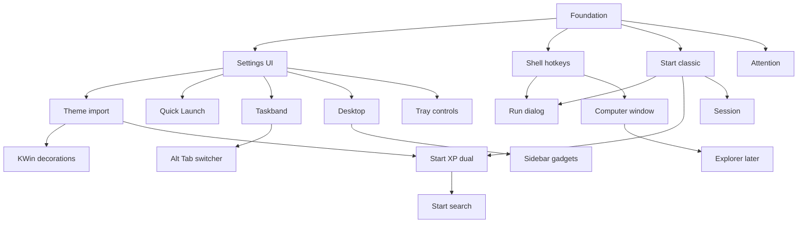
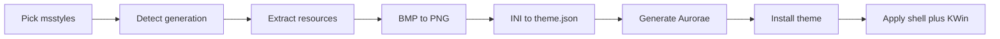

# QuickXP shell roadmap (epics and features)

> Canonical product roadmap for future work. Also mirrored at [`.cursor/plans/xp_shell_gap_analysis.plan.md`](../.cursor/plans/xp_shell_gap_analysis.plan.md).
> Last saved: 2026-10-08 (Epic G — Vista Sidebar gadgets).

Long-form XP shell inventory (reference checklist, not epic sizing): research attachment *Windows XP Shell Clone Specification* (~814 items). This roadmap stays epic-sized; IDs like STA-*/TSK-* below point at that inventory.

## Epic checklist

- [x] Epic 0 — Shell foundation (generation policy, theme seams, config store, Start popup host, app catalog, shared controls atlas)
- [ ] Epic S — Central tabbed Settings window (Theme, Taskbar, Desktop, Appearance, …) — partial: host + Theme/Taskbar stubs + Start right-click entry; Import/other tabs later
- [ ] Epic T — Theme import (partial: XP + Vista Aero project → user-data install → Settings Import…; Win7 map #32 still open)
- [x] Epic K — Generate and sync matching KWin Aurorae window decorations
- [ ] Epic QA — Testing (partial: harness + detect/project/pipeline/aurorae + extract/convert/list_themes + QML normalize + smoke checklist; bridges/CI later)
- [ ] Epic H — Shell hotkeys (Win/Ctrl+Esc, Win+R/E/F/D/M/L, Alt+Esc, Win+Tab taskbar cycle, …)
- [ ] Epic R — Run dialog (Win+R + Start → Run)
- [x] Epic 1 — Classic Start menu (single-column)
- [x] Epic 2 — XP dual-column Start menu
- [x] Epic 3 — Vista/7 Start search (jump-list stubs optional later — #82)
- [x] Epic 4 — Quick Launch, Show Desktop, and taskbar toolbars
- [ ] Epic 5 — Taskband (grouping + icon-only landed; height/multi-row/auto-hide/chrome menu remain)
- [x] Epic C — Tray system controls (volume mixer, BT, brightness, network, drives, battery)
- [ ] Epic A — Alt+Tab switcher (adapt quickshell-overview UI; KWin/Hypr backends)
- [ ] Epic 6 — Desktop wallpaper, icons, special objects, Recycle Bin
- [ ] Epic G — Vista Sidebar gadgets (docked sidebar first; free placement later)
- [ ] Epic 8 — Tray notification queue (view/dismiss) plus balloons and attention flash
- [ ] Epic 7 — Session dialogs + Windows-style lock screen
- [ ] Epic 9 — Explorer (later track)
- [ ] Epic 10 — Computer window (generation-skinned root; not full folder browsing)

---

Scope is the desktop shell (taskbar, Start, tray, desktop, session, theme import). The Computer root is Epic 10. Explorer folder windows stay a later epic.

Vista and 7 are presentation policy on shared backends, not a fork. Theme/shell key: `generation: "xp" | "vista" | "win7"` in [QuickXP/themes/luna/theme.json](QuickXP/themes/luna/theme.json) / [QuickXP/themes/aero/theme.json](QuickXP/themes/aero/theme.json). [QuickXP/Theme.qml](QuickXP/Theme.qml) already merges arbitrary JSON groups and live-reloads `theme.json`. Runtime policy: [QuickXP/GenerationPolicy.qml](QuickXP/GenerationPolicy.qml) resolves shell generation (follow theme or `Config.options.generation`) and per-feature overrides in `Config.options.generationOverrides` (empty = follow shell). Consumers call `GenerationPolicy.forItem("startMenu")` etc.

## Fidelity policy

Where stock XP and later/modern shell behavior disagree, generation (or an explicit setting) chooses the default. Do not silently ship Win7+ UX as “XP mode.”

| Area | Stock XP | Modern / Vista–7 path | QuickXP rule |
|---|---|---|---|
| Notification retention | No history after balloon dismiss (TRY-12) | Persistent tray queue / Action Center–like flyout | Queue off or minimal for `generation: xp`; full queue for `vista` / `win7` (or “retain notifications” setting) |
| Win+Tab | Cycles **taskbar button focus** | Flip 3D / overview | XP default = taskbar cycle (Epic H); Super+Tab overview is optional modern/generation policy (Epic A), not XP default |
| Taskbar grouping | Crowd-triggered when space is tight (TSK-16) | Always-grouped combined buttons | Support both; “Windows XP taskbar” preset = crowding-triggered; modern preset may keep always-on |
| Live peeks | No stock Aero thumbnails (TSK-22) | Icon-only thumbnail strips | Gated by `iconsOnly` / generation (Epic 5); XP list groups stay title menus |
| Desktop gadgets | None (Active Desktop out of scope) | Vista Sidebar dock; Win7 free gadgets | Off for `generation: xp`; Sidebar for `vista`; free placement later for `win7` (Epic G) |

## Already implemented (baseline)

- Themes with live reload; Luna sprites; Aero color-only stub.
- Bottom taskbar, Start button chrome (no menu), task buttons, paging, system menu, KWin window peek, dual window backends, tray with hide-inactive, clock.
- **Offline theme tooling (CLI only):**
  - [scripts/extract_xp_theme.py](scripts/extract_xp_theme.py) — PE resource dump from `.msstyles` / `Shellstyle.dll` (bitmaps + TEXTFILE/UIFILE/strings).
  - [scripts/convert-theme-bmps.py](scripts/convert-theme-bmps.py) — BMP → PNG with alpha / color-key from theme INI.
  - Hand-authored [QuickXP/themes/luna/theme.json](QuickXP/themes/luna/theme.json) mapping logical keys → image paths (Epic T replaces this with INI-driven generation so new `.msstyles` need no hand edits).

Key shell files: [QuickXP/taskbar/TaskBar.qml](QuickXP/taskbar/TaskBar.qml), [QuickXP/taskbar/TaskList.qml](QuickXP/taskbar/TaskList.qml), [QuickXP/tray/Tray.qml](QuickXP/tray/Tray.qml), [QuickXP/Theme.qml](QuickXP/Theme.qml), [QuickXP/services/kwin/tasks.js](QuickXP/services/kwin/tasks.js), [QuickXP/services/TasksBridge.py](QuickXP/services/TasksBridge.py).

---

## Epic 0 — Shell foundation

Shared seams so later epics do not hardcode XP-only assumptions.

- [x] **Generation / layout policy** — [`QuickXP/GenerationPolicy.qml`](../QuickXP/GenerationPolicy.qml): shell generation defaults from theme (`Theme.generation`) or `Config.options.generation`; each layout/fidelity item (Start, Quick Launch, grouping, peeks, notifications, Win+Tab, clock, Alt+Tab) has `Config.options.generationOverrides.<id>` (empty = follow shell). Settings → Theme exposes shell + per-item overrides. Feature epics consume via `GenerationPolicy.forItem(...)`.
- [x] **Config store** — [`QuickXP/Config.qml`](../QuickXP/Config.qml) `JsonAdapter` at `Quickshell.dataPath("config.json")`: theme, generation, generationOverrides, taskbar height, group/iconsOnly/lock/autoHide/quickLaunch/matchWindowBorders, lastSettingsTab.
- [x] **Start popup host** — [`QuickXP/start/StartPopupHost.qml`](../QuickXP/start/StartPopupHost.qml): open/close/toggle from Start button, dismiss on outside click / Esc, position above Start. Classic chrome (no search); Programs cascade and shell rows follow in Epic 1.
- [x] **App catalog adapter** — [`QuickXP/AppCatalog.qml`](../QuickXP/AppCatalog.qml) over Quickshell `DesktopEntries` (filter, icon, launch); helpers in [`AppCatalogFilter.js`](../QuickXP/AppCatalogFilter.js).
- [x] **Installed theme registry** — [`QuickXP/ThemeRegistry.qml`](../QuickXP/ThemeRegistry.qml) lists `themes/*/theme.json` (name, generation, path); Apply switches `Theme.name` without restart.
- [x] **Open Settings API** — [`QuickXP/settings/Settings.qml`](../QuickXP/settings/Settings.qml) `Settings.open(tab)` for Start/taskbar/desktop Properties deep-links.
- [x] **Shared controls atlas** — Under [`QuickXP/controls/`](../QuickXP/controls/): pushbutton, checkbox, radio, edit, combo, tab, spin, groupbox, scroll view, tooltip, message-box, focus-rect with hover/pressed/disabled/focus. Luna keys in `themes/luna/theme.json`; grow further via Epic T as needed.

---

## Epic S — Central Settings window

One tabbed configuration UI for the shell (XP-styled dialog chrome). This is the home for theme import, taskbar options, desktop options, and later panels — not separate one-off dialogs.

### Shell

- [x] **Window host** — [`SettingsWindow.qml`](../QuickXP/settings/SettingsWindow.qml) `FloatingWindow` with OK / Cancel / Apply (XP Display Properties pattern): Cancel discards draft; Apply writes config + theme side effects (Aurorae sync when Match window borders is on).
- [x] **Tab bar** — Extensible tab list on the host; deep-link via `Settings.open("theme")` etc.
- [x] **Draft vs applied** — [`SettingsDraft.qml`](../QuickXP/settings/SettingsDraft.qml); Theme tab previews candidate assets without mutating live `Theme.name` until Apply.
- [x] **Entry points** — **Primary: right-click the Start button** → Properties ([`StartChromeMenu.qml`](../QuickXP/settings/StartChromeMenu.qml)). Still open: empty-taskbar / desktop Properties; Start menu Control Panel stub.

### Tabs (initial set)

- [x] **Theme** — Installed list + color-scheme dropdown + taskbar/Start/titlebar preview + “Match window borders” (Aurorae sync on Apply) + shell generation / per-feature generation overrides. Import… installs one pack (all schemes + aurorae/); Delete removes user-data themes; Regenerate borders for installed themes.
- [x] **Taskbar** — Lock, auto-hide, group, icons-only, height slider (24–72), Quick Launch, XP / icon-preview presets. **Icons only** and **Group similar** apply on Apply (compact buttons; crowding vs always-combine by `iconsOnly`; XP list / thumbnail group popups). Height applies on Apply. Later: auto-hide behavior, keep-on-top, multi-row, Quick Launch.
- [x] **Start Menu** — Classic + XP Customize (Programs source, MFU count, Clear List, place link/menu/hidden, highlight-new, personalized menus).
- [x] **Debugging** — Dev aids (keep Start open by default / skip grab-hover dismiss; survives hot reload).
- [ ] **Desktop** — Wallpaper path/fit, icon arrange/align defaults, special-icon visibility, Show Desktop Icons (when Epic 6 exists).
- [ ] **Notification Area** — Hide inactive icons; per-icon Always show / Always hide / Hide when inactive + Customize list + Restore Defaults; which system control icons to show (volume, network, Bluetooth, brightness, drives, battery); Show Clock; notification queue retention (generation-gated); balloon on/off (Epic 8 / Epic C).
- [ ] **Appearance / Effects** (Display Properties–shaped) — Windows and Buttons style (**Luna vs Windows Classic**, independent of Classic Start — REF-11 / VIS-03), color scheme, font size; Effects: menu/tooltip fade vs scroll, menu shadows, hide mnemonic underlines until Alt (DSP-09–17). Can ship as Theme sub-pages or a dedicated tab.
- [ ] **Screen Saver** — Select saver, wait time, “On resume, display Welcome screen” / password → lock integration (DSP-06–07 / Epic 7).
- [ ] **About** (optional) — Version, links, “Open theme folder”. (Placeholder tab present.)

Tabs can ship empty/disabled until their epic lands; Theme + skeleton Taskbar first.

### Extensibility

- [x] Register a tab as a QML component + id + title so Explorer or future panels do not fork the host.
- [ ] Generation may hide or rename tabs (e.g. Vista “Personalization” labeling later) without splitting the config store.

---

## Epic T — Theme import (Settings → Theme)

**Goal:** an end user loads an `.msstyles` (or `.theme` / folder) and gets a working QuickXP theme with **no hand-authored `theme.json` and no per-theme art edits**. Extracted uxtheme assets and INI are the source of truth; the importer projects them onto QuickXP’s logical keys automatically.

Most of the hard work already exists as CLI extract/convert. The gap is: generation detection, a **deterministic INI → logical-key projector**, Vista/7 parsers, and wiring that into **Settings → Theme** (Import wizard).

Library stays callable from CLI for testing/CI; GUI is the Settings Theme tab.

### Design principle — use extracted assets directly

- **INI is authoritative.** Classes like `[button.pushbutton]`, `[Tab.TopTabItem]`, `[Tab.Pane]`, `[button.checkbox]`, `[TaskBar.*]`, `[Start.*]`, `[Window.*]`, `[SysMetrics]` already name images, `SizingMargins`, `imageCount`, `ImageLayout`, and colors. Do not invent parallel art; resolve `ImageFile` / `ImageFileN` to the converted PNG beside the extract.
- **`theme.json` is generated output**, not a hand-maintained skin. It is a thin projection: logical key → relative path + margins/frames/colors needed by QML (`Theme.image` / `Theme.value`). Re-running import on the same `.msstyles` should regenerate it.
- **Stable logical key set** for shell + Settings chrome (already consumed by taskbar / [`QuickXP/controls/`](../QuickXP/controls/)): e.g. `taskbarImage`, `startButtonImage`, `taskButtonImage`, tray chevrons, `buttonImage`, `tabItemTopImage`, `tabPaneEdgeImage`, `checkBoxImage`, caption/frame keys for Epic K. Grow the set as QML gains controls (Epic 0 atlas); each new key must cite the INI section it reads.
- **One shared class→key table** (code, versioned, tested) maps uxtheme section names → logical keys. Per-theme differences are only which files the INI points at (Blue vs Homestead vs Metallic vs third-party names).
- **Fallbacks stay in `Theme.qml` defaults** when a section/file is missing; never require the user to patch JSON.
- **Classic visual style** — Windows Classic is a first-class appearance path (bevels, system colors), not a recolor of Luna; may be a built-in theme / generation path rather than an `.msstyles` import.

### Pipeline (shared, not GUI-only)

- [x] **Pick input** — Settings file dialog for `.msstyles` and `.theme`. CLI: [`scripts/import_xp_theme.py`](../scripts/import_xp_theme.py).
- [x] **Detect generation** — [`quickxp_theme.detect`](../scripts/quickxp_theme/detect.py): TEXTFILE/BMP → `xp`; `VARIANT`+`CMAP` → `vista` (file version 6.0) or `win7` (6.1). Win7 still has no part map.
- [x] **Extract** — Library at [`scripts/quickxp_theme/extract.py`](../scripts/quickxp_theme/extract.py); thin CLI [`scripts/extract_xp_theme.py`](../scripts/extract_xp_theme.py). Bitmaps + TEXTFILE/INI land in a theme working tree.
- [x] **Convert transparency** — Library at [`scripts/quickxp_theme/convert.py`](../scripts/quickxp_theme/convert.py); thin CLI [`scripts/convert-theme-bmps.py`](../scripts/convert-theme-bmps.py). PNGs keep the extract layout so INI paths resolve 1:1.
- [x] **Project INI → `theme.json`** — [`quickxp_theme.project`](../scripts/quickxp_theme/project.py) + [`class_key_map`](../scripts/quickxp_theme/class_key_map.py). Parses size/color INI; resolves `ImageFile` → `BLUE_*_BMP.png`; emits colors/sizes/control groups. Missing keys omit (Theme defaults); warnings collected.
- **Generate KWin decoration** — See Epic K (same import pass or on Apply), driven by the same projected caption assets.
- [x] **Install** — User data `Quickshell.dataPath("themes/<slug>/")` via [`pipeline.import_theme`](../scripts/quickxp_theme/pipeline.py); multi-root [`list_themes.py`](../QuickXP/services/list_themes.py) + [`ThemeRegistry.qml`](../QuickXP/ThemeRegistry.qml); [`Theme.qml`](../QuickXP/Theme.qml) prefers registry path.
- [x] **Apply live** — Import selects the new slug in the Settings draft; Apply sets `Theme.name` and live-reloads `theme.json`. Sync KWin when “Match window borders” is on (Epic K).

### GUI features (Theme tab + Import)

- [x] **Theme tab content** — Installed themes list, preview (taskbar + Start), Apply / Delete stub. Toggle: “Match window borders” (default on).
- [x] **Import…** — Browse `.msstyles` → probe → install one theme with all schemes in `schemeData` → refresh registry. ([`ThemeTab.qml`](../QuickXP/settings/ThemeTab.qml))
- [x] **Color scheme picker** — Theme list + scheme dropdown for the selected pack (`Config.themeScheme` / `Theme.scheme`); schemes listed by [`quickxp_theme.schemes`](../scripts/quickxp_theme/schemes.py).
- [x] **Delete** — Removes user-data themes only (`delete_theme.py`); builtins stay.
- [x] **Error reporting** — JSON `{ ok, warnings, errors }` from probe/install; `XpMessageBox` + status text. Win7 import explains that the part map is not in yet.

### Generation-specific work

- [x] **XP** — Proven on checked-in Luna extract (pytest golden) + alternate `ImageFile` names fixture; Settings Import wired for real `.msstyles`. Homestead/Metallic are the same projector with a different INI path.
- [x] **Vista (#32)** — [`quickxp_theme.aero_binary`](../scripts/quickxp_theme/aero_binary.py) decodes the shared Aero property store (CMAP / VMAP / VARIANT / IMAGE). [`aero_vista`](../scripts/quickxp_theme/aero_vista.py) maps Vista parts onto the existing logical keys. Stock Vista Aero ships as [`QuickXP/themes/aero`](../QuickXP/themes/aero). Shell glass (taskbar, Start, peek) follows generation `vista`/`win7`. Apply with “Match window borders” turns KWin blur and contrast on for those generations and off for XP/Classic. Aero caption, taskbar, and Start images keep the alpha stored in the theme; Luna frames stay opaque.
- [ ] **Windows 7 (#32)** — [`aero_win7.BINDINGS`](../scripts/quickxp_theme/aero_win7.py) is the same binding shape and is still empty. A 6.1 file parses, then import stops with “Win7 map is not implemented yet”.

### Acceptance (Epic T XP slice)

- [x] Settings → Theme → Import… XP `.msstyles` → scheme pick if needed → install under data path → Apply live-reloads chrome without hand JSON.
- [x] pytest covers detect + Luna Blue projection (+ alt ImageFile fixture) + pipeline install.
- [x] Vista projection: pytest covers a synthetic property store plus the stock Vista pack when that `.msstyles` is present. Builtin `themes/aero` is that projection.
- [ ] Win7 part map (#32) remains open — epic stays partial until then.

### Out of scope for v1 of this epic

- Third-party “theme pack” zip formats beyond a clear `.theme` + `.msstyles` tree (can add later).
- Perfect pixel parity for every odd third-party skin on day one — grow the class→key table and fallbacks; do not ask users to hand-map.

---

## Epic K — KWin window decorations (generate + sync)

Goal: when the shell theme is applied, **window titlebars and caption buttons match the taskbar** (same Luna/Aero color scheme). Target format: **Aurorae** (`~/.local/share/aurorae/themes/<id>/` with `metadata.desktop`, `<id>rc`, `decoration.svg`, button SVGs).

### Generate

- [x] **Map caption assets** — [`class_key_map`](../scripts/quickxp_theme/class_key_map.py) + projector: `Window.Caption` / frames / close·min·max·restore·help (+ glyphs) → logical image keys + `caption` / `frame` groups; active/inactive caption frames sliced for preview.
- [x] **Emit Aurorae package** — [`quickxp_theme.aurorae`](../scripts/quickxp_theme/aurorae.py): `decoration.svg`, button SVGs, `quickxp-<slug>rc`, `metadata.desktop` under `themes/<slug>/aurorae/`. Id = `quickxp-<slug>`.
- [x] **Generate from import** — [`pipeline.import_theme`](../scripts/quickxp_theme/pipeline.py) emits Aurorae after projection (best-effort warnings if caption art missing).
- [x] **Luna fixture package** — Checked-in [`QuickXP/themes/luna/aurorae/`](../QuickXP/themes/luna/aurorae/).

### Synchronize

- [x] **On Apply** — [`sync_aurorae.py`](../QuickXP/services/sync_aurorae.py) copies to `~/.local/share/aurorae/themes/quickxp-<slug>/`, selects via `kwriteconfig6` + KWin `reconfigure`. Wired from Settings Apply when “Match window borders” is on; auto-generates package if missing.
- [x] **Toggle off** — Leaves KWin decoration alone.
- [x] **Non-KDE** — Returns `skipped` + warning; shell theme still applies.

### Features

- [x] **Regenerate** — CLI [`scripts/generate_aurorae.py`](../scripts/generate_aurorae.py) / Settings “Regenerate borders”; `import_xp_theme.py --aurorae-only`.
- [x] **Preview** — Theme tab Sample shows fake active titlebar + close chrome from caption assets.
- [x] **Vista/7 glass decoration (QML)** — KWin QML decoration draws the loaded theme's DWMWindow atlas (glass plate, reflection, caption highlight, outline, grouped caption buttons, title glow) and sets a blur mask. XP and Classic keep the Aurorae SVG path. Aurorae SVG for Vista/7 stays the opaque Basic fallback.
- [x] **pytest** — [`tests/theme/test_aurorae.py`](../tests/theme/test_aurorae.py) (Luna emission + sync install-only).

### Risks / notes

- Aurorae SVG layout is finicky; Luna Blue is the golden reference — third-party packs may need margin tweaks.
- Maximized borderless / no-border apps stay compositor policy.
- Aero glass: shell panels blur behind the theme’s own alpha bitmaps; KWin blur/contrast is toggled with border sync. Luna frames stay opaque, and the blur plugin is turned off with that theme.

---

## Epic H — Shell hotkeys

Central shortcut ownership so Start, Run, session, and taskband do not each invent conflicting grabs. Coordinate with KWin/Plasma global shortcuts; document disable steps where needed.

- **Start** — Windows key or Ctrl+Esc opens Start; Esc / outside click dismisses (Epic 1 host).
- **Run** — Win+R → Epic R.
- **Explorer** — Win+E opens the Computer window (Epic 10). Until that lands, a stub may launch the system file manager. Descending into folders is Epic 9.
- **Search** — Win+F opens XP Search Companion path when that lands; until then stub or system search. Distinct from Vista Start search box (Epic 3).
- **Desktop** — Win+D toggles Show Desktop; Win+M minimizes eligible windows; Shift+Win+M restores (Epic 4 / Epic 5).
- **Lock** — Win+L → Epic 7 lock.
- **Desktop Alt+F4** — Invokes Turn Off Computer (Epic 7), not only closing a window.
- **Alt+Esc** — Cycle eligible windows without showing the Alt+Tab overlay (WIN-16).
- **Win+Tab (XP default)** — Cycle **taskbar button focus** / activation sequence; must **not** open Flip 3D or the modern overview under `generation: xp`.
- **Ctrl+Shift+Esc** — Open Task Manager (launch system TM first; XP-like TM is optional later).
- **Ctrl+Alt+Delete** — Windows Security surface or Task Manager per session config (Epic 7).
- **Optional modern** — Super+Tab full overview only when generation/Settings opts in (Epic A); never as silent XP default.

---

## Epic R — Run dialog

First-class Run UI (LNK-17–21), not only a Start menu stub row.

- **Dialog** — Open field, Browse, OK, Cancel; XP-styled chrome from shared controls.
- **Launch resolution** — Applications, paths, documents, folders, URLs; environment expansion and association dispatch; honest failure UI (no silent terminal handoff).
- **History / autocomplete** — Per-user remembered entries; clear via Start Customize / settings path when that exists.
- **Entry points** — Win+R (Epic H); Classic and XP Start → Run.

---

## Epic 1 — Classic Start menu (single-column)

Ship first for Start UX. Classic Windows menu: one column of cascaded folders and items, plus session commands at the bottom.

- [x] **Open from Start button** — Wire [QuickXP/taskbar/TaskBar.qml](QuickXP/taskbar/TaskBar.qml) Start `MouseArea`: left-click opens classic Start; right-click Properties / Settings ([`StartChromeMenu.qml`](../QuickXP/settings/StartChromeMenu.qml)). Placeholder Programs row until cascade lands.
- [x] **Programs cascade** — Recursive flyouts via [`MenuBridge.py`](../QuickXP/services/MenuBridge.py) (XDG) or category buckets ([`StartMenuModel.js`](../QuickXP/StartMenuModel.js)); toggle `Config.options.startProgramsSource` in Settings → Start Menu.
- [x] **Fixed shell items** — Documents / Settings / Help / Search / Run as classic menu rows (Run → Epic R stub; Search stub → later Search Companion).
- [x] **Favorites / recent docs** — Documents submenu includes recent from `recently-used.xbel`; Favorites from GTK bookmarks when present ([`RecentBridge.py`](../QuickXP/services/RecentBridge.py)). Clear list in Customize (#67).
- [x] **Bottom session rows** — Log Off / Shut Down with confirm → [`SessionBridge.py`](../QuickXP/services/SessionBridge.py) (`loginctl` / `systemctl`); Epic 7 replaces confirms with full dialogs.
- [x] **Keyboard nav** — Up/down, Enter/Right open, Left/Esc close submenu then menu, letter mnemonics (`StartMenuModel` helpers + host Keys).
- [x] **Highlight newly installed** — Bold Programs entries not yet launched; seen ids in `Config.startSeenApps` ([`StartHighlightStore`](../QuickXP/StartHighlightStore.qml)).
- [x] **Personalized menus** — Optional hide of low-usage Programs apps behind `>>` ([`StartPersonalizeStore`](../QuickXP/StartPersonalizeStore.qml); off by default).
- [x] **Customize (Settings → Start Menu)** — Programs source, highlight-new, personalized menus, clear highlight / clear recent ([`StartMenuTab.qml`](../QuickXP/settings/StartMenuTab.qml)).

No dual-column chrome, no user tile, no search box in this epic.

---

## Epic 2 — XP dual-column Start menu

Builds on the classic app catalog and session hooks. Default Luna Start when `generation` is XP. Benefits from Epic T once imported themes supply Start menu bitmaps.

- [x] **Two-column frame** — Luna STARTPANEL skins (user bar, MFU/places columns), interactive account tile (`~/.face` + stub User Accounts) — STA-32.
- [x] **Left: pinned apps** — Pin/unpin (right-click), drag reorder, persisted list; defaults from WebBrowser/Email categories (STA-05).
- [x] **Left: most-frequent list** — Decay-scored MFU; excludes pins; right-click Remove from This List ≠ Unpin; Clear List API for Customize (STA-10–14).
- [x] **Left: All Programs** — Bottom “All Programs” + Luna arrow; reuses classic Programs cascade (`StartSubmenu`).
- [x] **Right: special folders** — My Documents / Recent / Pictures / Music / Computer / Network / Control Panel / Connect To / Printers / Admin Tools; link|menu|hidden via Config (STA-24–29).
- [x] **Right: Help / Search / Run** — XP right-column rows; Search/Help stubs; Run → Epic R stub; not the Vista search box.
- [x] **Bottom bar** — Log Off + Turn Off Computer buttons (Luna LOGOFF art; SessionBridge confirm).
- [x] **Layout switch** — `GenerationPolicy.forItem("startMenu")` selects Classic single-column vs XP dual-column stub (Settings → Theme overrides). Vista/7 keep XP chrome until Epic 3.
- [x] **Start Customize** — Settings → Start Menu: MFU count, Clear List, place link/menu/hidden, Programs source, highlight-new, personalized menus, clear recent/highlight (SMS core). Large/small icons + Internet/E-mail handler pick can deepen later.

---

## Epic 3 — Vista / Windows 7 Start search

Only after dual-column exists. Same Start host; add search as a first-class mode.

- [x] **Search box UI** — Focused `XpEdit` in the left column, directly under All Programs, when `GenerationPolicy.featureEnabled("startSearch")` (default on for `vista`/`win7`); type-to-filter without closing menu.
- [x] **App / document / setting results** — Ranked list via [`StartSearchModel.js`](../QuickXP/StartSearchModel.js) replaces the left column while typing (apps + recent docs + Settings tabs).
- [x] **Keyboard-first results** — Arrow keys + Enter to launch; Esc clears query or closes Start.
- [ ] **Jump-list stubs (Win7)** — Optional later slice inside pinned/recent rows (#82); not required for first search ship. Stock XP parity excludes jump lists.

---

## Epic 4 — Quick Launch, Show Desktop, and taskbar toolbars

XP-style Quick Launch between Start and the task band, plus other desk-band toolbars.

- [x] **Quick Launch strip** — Small icons; left-click launches; drag-drop to add shortcuts; remove via context menu. Persist list in `quickLaunchIds` ([QuickLaunch.qml](../QuickXP/taskbar/QuickLaunch.qml)).
- [x] **Show Desktop** — QL sentinel + `TasksService.toggleShowDesktop` / bridge snapshot restore (TSK-27).
- [x] **Settings toggle** — Taskbar tab `showQuickLaunch` drives strip visibility.
- [x] **Win7 far-right Show Desktop** — Thin tray-edge button when `GenerationPolicy` showDesktop is win7.
- [x] **Overflow chevron** — Launchers that do not fit open a popup menu (BAR-08).
- [x] **Toolbars beyond Quick Launch** — Desktop / Links / New Toolbar folder bands; Show Title; unlocked grippers (BAR-09–15). Language Bar stub until input subsystem (BAR-19).
- [x] **Toolbar enable/disable** — Toolbars context menu toggles Quick Launch + Desktop/Links; New Toolbar folder picker; widths in `taskbarToolbars` (BAR-20).
- [x] **Height scaling** — QL icon size from taskbar height unit (`QuickLaunchModel.iconSizeForHeight`).
- **SP3 note** — Stock SP3 has no Address toolbar; do not list it as a default band.

---

## Epic 5 — Taskband behavior

Builds on existing buttons, pager, peek, and system menu. **Grouping** and **icon-only** are separate config flags and may be combined.

### Independent modes (and two reference UIs)

`groupButtons` and `iconsOnly` stay **separately applicable** and combinable. The two screenshots are the main presets users will toggle between:

1. **XP-style (list groups)** — Text labels on; grouping per **crowding / similar-window policy** (see below). Button shows app icon + **count** (e.g. `10`) + **application name**. Click/open group → **vertical menu of window titles** (icon + caption per window), Luna blue list like classic XP — not thumbnails. Ungrouped windows stay individual titled buttons. Quick Launch stays available.
2. **Modern-style (thumbnail groups)** — Icons only on; grouping on. Compact icon buttons; hover/click group → **horizontal strip of live peeks**, one thumbnail (+ mini title) per window, selectable to activate (Win7/10-style). Single-window apps can show one peek or activate directly. Live peeks are **not** stock XP (TSK-22); gate by `iconsOnly` / generation.

Settings → Taskbar exposes the two booleans plus optional **presets**: “Windows XP taskbar” / “Icon taskbar with previews” that set both flags (and default group-popup mode) in one click. Users can still mix (e.g. icons only without grouping).

### Grouping policy

- [x] **Crowding-triggered (XP)** — When `groupButtons && !iconsOnly`, combine by `appId` only if the flat band would page ([`TaskbandModel.js`](../QuickXP/TaskbandModel.js)); reverse when room returns. Order follows first-seen app.
- [x] **Always grouped (modern)** — When `groupButtons && iconsOnly`, always combine by `appId`.
- Policy is implied by the two booleans (no separate `groupWhenCrowded` key yet); Theme → generationOverrides.taskbarGrouping still unused by the taskband.

### Group popup modes

- [x] **List popup** (XP) — When `!iconsOnly`: [`TaskGroupMenu.qml`](../QuickXP/taskbar/TaskGroupMenu.qml) stacked titles; click activates.
- [x] **Thumbnail strip** (modern) — When `iconsOnly`: [`TaskGroupStrip.qml`](../QuickXP/taskbar/TaskGroupStrip.qml) side-by-side peeks via KWin Preview DBus.
- [ ] **Hover raises, does not focus** — While the pointer is over a thumbnail, **bring that window to the front** without keyboard focus; leave restores z-order. **Click** activates. Deferred (DBus raise-without-activate).
- Config can override popup style independently later if needed; default ties list↔labeled and thumbnails↔icons-only.
- Single-window groups: activate on click; optional single peek on hover (already implemented for KDE).
- Right-click: system menu on the representative window (group submenu later).
- XP **list** popup: click selects/activates (classic behavior).

### Taskbar height and rows

- **Configurable height** — Settings → Taskbar sets height in pixels (or discrete steps). That value is the **single height unit** for the bar (`Theme.sizes.taskbarHeight` overridden by config).
- **Uniform scale** — Current layout rules stay the same; Start button, task buttons, pager, tray icons, Quick Launch icons, and themed sprites scale up/down to fit the unit while **preserving aspect ratio** (letterbox/pillarbox inside the unit as needed; do not distort Luna sprites).
- **Min/max** — Sensible clamps (e.g. ~24–72px) so paging/caps math remains valid.
- **Multi-row / vertical width** — Unlocked taskbar can grow to multiple rows (or a wider vertical bar); lock freezes band layout (TSK-03–04). Height slider alone is not full XP resize behavior.

### Button interactions

- **Click inactive/minimized** — Activate or restore (TSK-13).
- **Click active eligible button** — Minimize that window (TSK-14).
- **Ctrl+multi-select** — Select multiple taskbar buttons for collective window operations (TSK-20); VERIFY with grouping on/off.
- **Drag-hover activate** — Hovering a taskbar button during a drag can raise/activate the target for drop completion (TSK-23).
- **No stock drag-reorder of running buttons** — Do not treat modern reordering as XP parity (TSK-29).

### Other taskband features

- **Empty-taskbar context menu** — Toolbars, Lock, Cascade, Tile H/V, Show Desktop, Task Manager, Properties → `Settings.open("taskbar")`.
- **Cascade / tile / show desktop** — Extend [QuickXP/services/kwin/tasks.js](QuickXP/services/kwin/tasks.js) (and Wayland path where possible).
- **Auto-hide** — Slide bar off-screen; reveal on edge hover; test with Start open, full-screen apps, and keyboard focus cases (TSK-05).
- **Keep on top + work area** — Configurable keep-on-top; reserve work area so maximized windows do not cover a non-auto-hidden bar; full-screen apps interact with visibility per policy (TSK-06–08).
- **Screen edge** — Top/left/right docking later; height unit still applies (horizontal bars use height; vertical bars use width as the unit).
- **Attention flash** — Use unused Luna task-button frame when window demands attention.
- **Multi-monitor** — Stock XP default is a primary taskbar, not duplicated per-monitor bars (TSK-30); document any Linux multi-bar opt-in as non-stock.

---

## Epic C — Tray system controls

Hardware and session status live in the notification area beside SNI icons / clock ([TraySystemControls.qml](../QuickXP/tray/TraySystemControls.qml)).

### Volume (Windows 7–style mixer) — first priority

- [x] **Tray speaker icon** — Wheel/middle-click; click opens mixer ([VolumeMixer.qml](../QuickXP/tray/VolumeMixer.qml)).
- [x] **Device volume + default sink** — Master slider; sink list sets `Pipewire.preferredDefaultAudioSink`.
- [x] **Per-application volume** — `PwNodeLinkTracker` rows; collapse/expand Applications.
- [x] **Per-app output routing** — Move to sink via `pactl move-sink-input`.
- [x] **Mic** — Default source section in the same popup.

### Other tray controls

- [x] **Network** — `Quickshell.Networking` popup (Wi‑Fi toggle + connect/disconnect).
- [x] **Bluetooth** — Adapter on/off; device connect/disconnect.
- [x] **Brightness** — `BrightnessService` + `brightnessctl`; hidden when unavailable.
- [x] **Battery / power** — UPower display device icon/tip/popup; hidden without battery.
- [x] **Removable drives** — `DrivesBridge.py` (lsblk + udisksctl) open/eject.
- [x] **Visibility** — Settings → Notification Area toggles (`trayShow*`).

### Clock

- [x] **Show Clock** — `trayShowClock`.
- [x] **Hover date** — Long locale date tip.
- [x] **Double-click** — `kcmshell6 kcm_clock` (Vista/7 calendar flyout deferred).
- [x] **Tall bar** — Extra date line when taskbar height ≥ 40.

### Notes

- Coexist with third-party SNI icons; disable Plasma tray applets when using QuickXP controls (see SMOKE).
- XP popups first; Win7 mixer heading when shell generation is win7.

---

## Epic A — Alt+Tab / task switcher

Replace (or sit in front of) the compositor’s default switcher with a QuickXP-owned overlay. **Reference implementation to adapt:** [Shanu-Kumawat/quickshell-overview](https://github.com/Shanu-Kumawat/quickshell-overview) — live window previews, keyboard navigation, click-to-focus, screencopy (`live` / `event` modes), IPC toggle.

### Important constraint

That project is a **Hyprland workspace overview** (Super+Tab, Hyprland IPC, multi-workspace grid). QuickXP today is KWin-first. Do **not** drop it in unchanged on Plasma. Treat it as:

- UI/UX and screencopy patterns to reuse or vendor selectively
- A Hyprland backend path if/when QuickXP runs under Hyprland
- On KDE: same switcher chrome backed by existing task list + [QuickXP/services/preview/quickxp-preview.cpp](QuickXP/services/preview/quickxp-preview.cpp) / KWin ScreenShot2 (and raise/activate via [QuickXP/services/kwin/tasks.js](QuickXP/services/kwin/tasks.js))

### Behaviors

- **Alt+Tab / Alt+Shift+Tab** — Hold Alt to keep the switcher open; Tab cycles highlight; release Alt activates the selected window (classic Windows). Also support click-to-activate and Esc to cancel.
- **Alt+Esc** — Cycle eligible windows **without** showing the switcher UI (Epic H / WIN-16); separate from Alt+Tab.
- **Layout by generation / Settings**
  - **XP classic** — Horizontal (or grid) of icons + window titles (no live thumbs required). Stock XP has no PowerToy Alt-Tab Replacement preview (§32 exclusions).
  - **Preview switcher** (Vista/7+/default for “modern” taskbar) — Thumbnail grid/strip inspired by quickshell-overview window cards; share peek tech with grouped taskbar previews.
  - **Optional full overview mode** — Super+Tab (or Settings) opens a larger overview closer to quickshell-overview when generation/Settings opts in. **Not** the XP meaning of Win+Tab (taskbar focus cycle — Epic H).
- **Keyboard** — Arrows / vim keys as in overview; number shortcuts optional.
- **Hover** — Optional raise-without-focus while cycling (same rule as taskbar thumbnail hover), if it does not fight Alt+Tab focus semantics; default off for classic XP list.
- **Grab shortcut** — Disable or override KWin/Plasma Alt+Tab (and Hyprland’s) so only QuickXP handles it; document the config step.

### Implementation slices

1. Overlay shell + Alt+Tab state machine (hold/cycle/release) using current window list.
2. XP icon+title skin.
3. Thumbnail cards using overview-inspired layout + existing KWin capture.
4. Hyprland backend adapter (optional) reusing more of quickshell-overview’s services layer under license (GPL — respect when vendoring).

Settings → Taskbar (or a small “Window switching” section): classic vs preview switcher; whether Super+Tab opens full overview (off for XP default).

---

## Epic 6 — Desktop

- **Wallpaper surface** — Use unused `images.wallpaper`; center / tile / stretch; importer may copy wallpaper from `.theme`.
- **Icon layer** — Icons from Desktop folder; select, open, drag, rename; marquee / Ctrl / Shift selection; type-to-select (DES-07–08, DES-20).
- **Special shell icons** — Recycle Bin default visibility; My Computer, My Documents, My Network Places (and IE if desired) visibility configurable (DES-04); distinct from ordinary shortcuts to those places (DES-05).
- **Recycle Bin** — Empty/full icon state; drag-to-delete; context Empty / Open; restore/empty operations and Properties (capacity, confirm delete, bypass bin) — usable before full Explorer (BIN-01–14). Linux storage may differ; preserve restore semantics.
- **Arrange / align to grid** — Align to Grid without continuous Auto Arrange; Auto Arrange separately; Arrange Icons By name/type/size/date (DES-11–13).
- **Show Desktop Icons** — Toggle hides the icon layer while keeping wallpaper (DES-14).
- **Desktop context menu** — Refresh, Paste, New, Properties → `Settings.open("desktop")`.
- **Multi-monitor** — Icon placement recovery after resolution/topology changes (DES-24).
- **Desktop Cleanup Wizard (later)** — Unused shortcuts → Unused Desktop Shortcuts folder (DES-21–23).
- **Active Desktop** — Out of scope. Vista/7 inbox gadgets are Epic G, not HTML wallpaper.

---

## Epic G — Vista Sidebar gadgets

Docked Vista Sidebar first. Free-floating placement (Windows 7) is a later slice in this epic and reuses the same gadget instances. On for `generation: vista` and an explicit setting. Off for `generation: xp`. `generation: win7` stays off until free placement; that slice is the Win7 default.

Built-in gadgets only. No third-party `.gadget` packages, ActiveX/HTML hosts, or the online gadget gallery. One feature per inbox gadget. Vista shipped Calendar, Clock, Contacts, CPU Meter, Currency, Feed Headlines, Notes, Picture Puzzle, Slide Show, Stocks, and Weather. Windows 7 dropped Contacts, Notes, and Stocks and added Windows Media Center. Network-backed gadgets (Feed Headlines, Weather, Stocks, Currency) are built-ins, not a license to load arbitrary web gadgets.

- **Sidebar host** — Right-edge dock (left optional); show/hide; above the desktop icon layer; generation-gated.
- **Gadget frame** — Chrome, close, in-bar reorder, per-gadget opacity.
- **Built-in gallery** — Add from a fixed catalog, not downloaded packages.
- **Persistence** — Which gadgets, order, and options in the existing config store.
- **Sidebar properties** — Side, always on top, start with the shell.
- **Clock** — Vista and Windows 7.
- **Calendar** — Vista and Windows 7.
- **Contacts** — Vista only.
- **CPU Meter** — Vista and Windows 7.
- **Currency** — Vista and Windows 7.
- **Feed Headlines** — Vista and Windows 7.
- **Notes** — Vista only.
- **Picture Puzzle** — Vista and Windows 7.
- **Slide Show** — Vista and Windows 7.
- **Stocks** — Vista only.
- **Weather** — Vista and Windows 7.
- **Windows Media Center** — Windows 7 only. The full Media Center / Royale product stays out of scope.
- **Free-floating placement (later)** — Undock onto the desktop; Win7 default.

---

## Epic 7 — Session dialogs and lock screen

Fed by logind / PAM / display-manager hooks as available. Start menu and shortcuts open these.

### Dialogs

- **Turn Off Computer dialog** — Stand by / Turn off / Restart (suspend / poweroff / reboot). Holding Shift can expose Hibernate instead of Stand by when available (SES-11). Disable choices the hardware/backend cannot honor.
- **Classic Shut Down** — Dropdown action selection vs Welcome-style power button panel, selectable by login/Start mode (SES-13).
- **Log Off dialog** — Log off / Switch user if available.
- **Windows Security** — Ctrl+Alt+Delete opens Task Manager or a Security dialog (lock / logoff / shutdown / Task Manager) per session config (SES-18–19).
- **Desktop Alt+F4** — Opens the appropriate session UI (Epic H).

### Windows-style lock screen

Full-screen lock UI owned by QuickXP (not only calling `loginctl lock-session` with the Plasma greeter). Generation skins the chrome.

- **Trigger** — Start → Lock; Win+L / configured shortcut; screen saver “On resume…” / password; idle timeout later (Settings).
- **XP Welcome-style** — Full-bleed wallpaper (or solid), user tile/name, password field, “Go” / Enter to unlock; optional “Click your user name” multi-user list if multiple seats/users are exposed. Luna-like blue panel / bubbly controls where assets exist.
- **Vista/7 style (later skin)** — Centered user tile, password box, ease-of-access / power affordances; can share the same unlock backend.
- **Unlock backend** — Authenticate via PAM / `polkit` / `logind` unlock; on success dismiss the lock surface and restore session. Coordinate so Plasma’s own locker does not fight QuickXP (disable SDDM/Plasma lock or chain: QuickXP UI → session unlock).
- **Secure surface** — Block input to apps underneath (fullscreen layer above shell); no click-through; Escape does not dismiss without auth.
- **Session actions on lock** — Optional Switch User / Shut Down from the lock screen (XP welcome had limited options; keep minimal at first).
- **Media / notifications** — v1: hide or queue notifications while locked; no sensitive content on the lock surface.

### Session lifecycle

- **Startup folder** — Launch user/common Startup entries after shell comes up (LNK-23 / SES-23).
- **Screen saver** — Settings tab wires wait time and resume-to-lock (Epic S / DSP-06–07).
- **Task Manager entry** — Context menus and Ctrl+Shift+Esc launch the system Task Manager first; XP-like TM UI is optional later (SES-21–22).

---

## Epic 8 — Attention and notifications

Primary UX: a **dismissible notification queue in the tray** (notification area), not only fleeting popups. Quickshell already provides `Quickshell.Services.Notifications.NotificationServer` — own the freedesktop notification bus, set `tracked = true` on receive, bind UI to `trackedNotifications`, call `dismiss()` / `expire()` from the queue.

Owns notifications for the session (coordinate with / replace dunst, mako, Plasma notifications, etc.).

- **NotificationServer host** — Singleton (e.g. beside [QuickXP/tray/Tray.qml](QuickXP/tray/Tray.qml) or a small `Notifications.qml` singleton): advertise body, actions, images, persistence as needed; keep tracked list.
- **Tray queue affordance** — Icon or badge in the tray (XP-style info balloon icon / chevron-adjacent control). Badge count for unread or active items. Click opens the queue popup above the tray.
- **Queue popup** — Scrollable list of active notifications: app icon/name, summary, body, timestamp. Per-item dismiss; “Clear all”. Optional action buttons from the notification. Closing an item calls `Notification.dismiss()`.
- **Arrival behavior** — New notification joins the queue (when retention is on) and optionally shows a short XP balloon tip (or Vista/7 toast later) that auto-hides.
- **Generation / retention** — Stock XP has **no** balloon history after dismiss (TRY-12). For `generation: xp`, prefer balloon + optional short-lived list; full persistent queue for `vista` / `win7` or an explicit retain setting (see Fidelity policy).
- **Per-icon Customize** — Always show / Always hide / Hide when inactive for SNI icons; Customize Notifications list of current/past icons; Restore Defaults (TRY-07–09). Elevate from “leave alone.”
- **Transient / replace / expire** — Honor `transient`, replace-id, and expire timeouts; expired items leave the queue unless persistence is on.
- **Task-button flash** — Separate signal path: window demands-attention still uses unused Luna task-button frame (Epic 5 overlap).
- **Generation skins** — XP: balloon + simple list. Vista/7: restyle toward Action Center / notification flyout later; same underlying server.

Suggested early slice (can ship before Start menu polish): Server + tray button + dismissible list. Balloons and skins can follow.

---

## Epic 9 — Explorer (later track)

Not started until Start, Quick Launch, and desktop exist. The Computer root itself is Epic 10; this epic is descending into folders and the rest of the file window.

- **Folder windows** — Browse filesystem with Luna chrome.
- **Navigation** — Back, Up, address bar.
- **Views** — Icons / list / details.
- **Tasks pane** — XP common tasks sidebar.
- Deeper inventory (Folder Options, ZIP/CD, Search Companion UI, Open/Save dialogs, Control Panel applets, COM extensions) stays in the long-form spec — do not block shell epics on those.

---

## Epic 10 — Computer window

Shell-owned Computer root. Start → My Computer currently opens `computer:///` in the system file manager. This epic replaces that with one generation-skinned window of disks and special places. Descending into a folder stays Epic 9. Win+E (Epic H) opens this window.

Computer is a virtual folder, not a directory. XP, Vista, and Windows 7 all list storage in groups and open a drive on double-click. Generation changes the chrome, not the disk list.

### Windows XP — title “My Computer”

- Menu bar is always on: File, Edit, View, Favorites, Tools, Help.
- Standard toolbar: Back, Forward, Up, Search, Folders, Views. Cut, Copy, Paste, Delete, and Properties can be added; they are not the default set.
- Separate address band (text, “My Computer”) and a status bar (object count, free space).
- Left side defaults to Common Tasks. The Folders button swaps that for the folder tree. Folder Options can turn tasks off (“Use Windows classic folders”).
- System Tasks on this folder: View system information, Add or remove programs, Change a setting.
- Other Places: My Network Places, My Documents, Shared Documents, Control Panel.
- Details: name, type, file system, used and free space. A thumbnail appears only after you are inside a folder and select a picture.
- Groups, Tiles view by default:
  - Files Stored on This Computer (workgroup PCs only): Shared Documents and each user’s documents. Hidden when the PC is on a domain.
  - Hard Disk Drives, with label, file system, and free/total.
  - Devices with Removable Storage: floppy, CD/DVD, Zip, USB.
  - Network Drives when any are mapped.
- Views: Thumbnails, Tiles, Icons, List, Details. Filmstrip is for picture folders, not this root. Details columns: Name, Type, Total Size, Free Space, Comments.
- Drive menu: Open, Explore, Search, Sharing and Security, Format, Eject (optical and removable), Rename, Create Shortcut, Properties.
- Empty optical drive: insert-disc prompt. Properties is General (label, type, file system, used/free pie) plus Tools, Hardware, Sharing, and Quota. Only General belongs in the first slice.

### Windows Vista — title “Computer”

- Menu bar hidden until Alt, or pinned from Organize → Layout.
- Back and Forward stay. The Up button is gone (Alt+Up or the breadcrumb). Address bar is breadcrumbs (Desktop > Computer) plus a search box that filters this view.
- Command bar for this folder: Organize, System properties, Uninstall or change a program, Map network drive, Open Control Panel. Properties shows when a drive is selected. Views is a split button.
- Organize covers cut/copy/paste, layout, folder options, rename, delete, and close.
- Left side is the Navigation pane: Favorite Links (Documents, Pictures, Music, Recently Changed, Searches) and a Folders tree. The XP task list is gone.
- Details pane along the bottom is on by default. Preview pane is off until Organize → Layout.
- Groups: Hard Disk Drives, Devices with Removable Storage, Network Location. “Files Stored on This Computer” is gone; those folders moved to Favorite Links and the user folder.
- Tiles remain the default and show a used-space meter. Details adds a File System column.
- Drive menu: Open, Open in new window, Share, Format, Eject, Rename, Create Shortcut, Properties.

### Windows 7 — still “Computer”

Same shell as Vista, with these Computer-window differences:

- Navigation pane sections: Favorites, Libraries, Computer, Network. Libraries (Documents, Music, Pictures, Videos as combined folders) are new here. Show the heading later; do not implement library membership in this epic.
- Command bar: Organize, System properties, Uninstall or change a program, Map network drive. Open Control Panel is no longer on this toolbar. A preview-pane toggle sits by Views and Help.
- Details pane can be dragged taller to show more properties.
- Groups and Tiles default match Vista, including the capacity bar.
- Win+E opens Computer. The taskbar’s Explorer pin often opens Libraries instead; that second entry point is not this epic.

### QuickXP shape

One window, skinned by `generation`:

- XP: “My Computer”, menu bar, standard toolbar, text address, status bar, Common Tasks.
- Vista: “Computer”, breadcrumb address, search filter, command bar including Open Control Panel, nav pane, bottom details.
- Windows 7: Vista chrome, command bar without Open Control Panel, preview toggle. Libraries section deferred.

Data, not drive letters: fixed mounts, removable disks from the existing UDisks path in [QuickXP/services/DrivesBridge.py](../QuickXP/services/DrivesBridge.py), and mounted network filesystems. XP’s “files stored on this computer” maps to the home folder and `~/Public` when that directory exists.

v1 actions: open a mount with the system file manager, eject removable media, and a General-style properties dialog (label, file system, used, free). System properties and “change a setting” open existing Settings or a short system-info page. Add/remove programs, map network drive, format, and disk tools stay labeled stubs.

- **Computer window shell** — Generation chrome (title, frame, and the bars above).
- **Drive groups** — Fixed, removable, and network, plus the XP user-folder group.
- **Open, eject, and properties** — Open hands the mount to the system file manager; eject uses the drives bridge; properties is the General page only.
- **XP tasks pane** — Menus, toolbar, address, status, System Tasks, Other Places, Details.
- **Vista/7 chrome** — Command bar, breadcrumb, search filter, nav pane, details pane. Win7 omits Open Control Panel and adds the preview toggle.
- **Launch** — Start → My Computer and Win+E open this window instead of `computer:///`.

---

## Epic QA — Testing

**Partial.** Harness lives under [`tests/`](../tests/); library wrap in [`scripts/quickxp_theme/`](../scripts/quickxp_theme/). Prefer cheap, reliable coverage on the theme pipeline and pure logic; keep full-shell checks thin. **New pipeline / helper features must land with tests** (see [`.cursor/rules/testing.mdc`](../.cursor/rules/testing.mdc)). Run `./scripts/run-tests.sh` before every push (`.githooks/pre-push`).

- [x] **pytest scaffolding + theme tooling** — Importable [`quickxp_theme`](../scripts/quickxp_theme/) (extract/convert/detect/project/pipeline/schemes/aurorae). Real tests for parsers, BMP→PNG, detect, INI→`theme.json`, import install, Aurorae emission, `list_themes.scan_many`. Run `python3 -m pytest tests/` or `./scripts/run-tests.sh`.
- [x] **pytest for Python bridges (partial)** — Menu/Session/Recent/Shell helpers plus TasksBridge: stdin parse/dispatch, WindowsRunner token, apply-script contracts, and QML ownership scans (`tests/bridges/test_taskband_contracts.py`). Live DBus/KWin still out of suite.
- [x] **QML helper tests (`qmltestrunner`) (scaffold)** — [`GenerationNormalize.js`](../QuickXP/GenerationNormalize.js) + [`TasksModel.js`](../QuickXP/TasksModel.js) IPC helpers + TaskbandModel / Start models. Expand as features land. `./scripts/run-qml-tests.sh`.
- [x] **Shell smoke checks** — Manual checklist [docs/SMOKE.md](SMOKE.md) (REF-01); `./scripts/smoke-notes.sh` prints it. Not hermetic CI.
- **Reference profile** — Freeze English XP Pro SP3 / Luna blue / Welcome / default DPI as the main behavioral reference when capturing regressions (REF-01).
- [ ] **CI (optional later)** — GitHub Action running `pytest` on push; QML tests only if import paths resolve headlessly. Local gate: pre-push hook via `./scripts/install-git-hooks.sh`.

---

## Spec-derived backlog (shell)

Tracked here so the inventory is not forgotten, but not blocking the near-term epic order. Pull into epics when adjacent work lands.

- **Search Companion** — XP Search Results + Companion pane (SEA-*); Win+F / Start → Search for XP generation; distinct from Epic 3 Vista Start search box.
- **Sound scheme** — Map shell events (login, menu popup, minimize, balloon, …) to assets (ACC-17); provenance of XP WAV/fonts/wallpapers is a separate asset decision.
- **Task Manager UI** — After system-TM launch works: optional Applications/Processes/Performance tabs with real Linux process integration (SES-21–22).
- **Toolkit theming** — Luna/Classic for Qt/GTK client apps is a **separate deliverable** from shell chrome (LNX-14); do not promise universal pixel parity from the panel alone.
- **Desktop Cleanup Wizard** — DES-21–23 (also noted under Epic 6 later slice).
- **Reference validation scenarios** — Inventory TST-* (taskbar edges, grouping, tray customize, …) as smoke/regression prompts once features exist; do not import all 50 scenarios into this file.

### Explicitly out of near-term scope

Full Explorer §§10–16 / 18–26 depth, Control Panel applet recreation, Magnifier/Narrator/OSK suite, COM shell-extension ABI, Active Desktop (HTML wallpaper; inbox gadgets are Epic G), Media Center/Royale as a product (the Windows 7 Media Center gadget is Epic G), domain logon as stock requirements, and inventory-excluded modernisms (jump lists, Aero Snap, Action Center history as XP default, libraries). Third-party `.gadget` packages and the online gadget gallery stay out. Vista/7 address breadcrumbs on the Computer window are Epic 10, not a general Explorer rewrite. Libraries stay deferred.

---

## Epic ordering

1. Foundation (config store including height/group/iconsOnly + `Settings.open` + theme registry + controls atlas start)
2. Settings window shell (tabs, OK/Cancel/Apply, Theme + Taskbar stubs with height / group / icons-only)
3. Theme import pipeline (extract → INI project → install) + pytest scaffolding
4. Wire Import… into Settings → Theme (msstyles in, theme applied); KWin Aurorae generate/sync on Apply
5. Taskband height scaling (keeps current behavior, larger unit)
6. Grouping + icon-only (independent) + crowding vs always policy + multi-window peeks for groups
7. Quick Launch + Show Desktop (+ toolbar hooks)
8. Shell hotkeys (Epic H) + Run dialog (Epic R)
9. Alt+Tab switcher (XP list first; then overview-style thumbnails; grab compositor shortcut)
10. Classic Start (right-click Start → Settings already usable)
11. Session dialogs (Turn Off / Log Off / Hibernate-via-Shift)
12. Windows-style lock screen (XP Welcome skin first; wire Win+L + screen saver resume)
13. XP dual-column Start (+ Customize depth)
14. Tray system controls — volume mixer first, then network / BT / brightness / drives / battery + clock Properties
15. Tray notification queue + per-icon Customize + Notification Area tab polish (XP retention policy)
16. Desktop + special icons + Recycle Bin + Desktop tab
17. Vista Sidebar gadgets (Epic G) after the desktop surface exists; free placement follows
18. Taskband chrome menu + cascade/tile + auto-hide + keep-on-top / work area
19. Optional Super+Tab full overview / Hyprland adapter (not XP Win+Tab default)
20. Vista/7 Start search + Vista/7 lock/theme skins + Appearance/Classic style polish
21. Computer window (Epic 10) — root only, before full folder browsing
22. Explorer (+ Search Companion / sound scheme / toolkit theming from backlog as capacity allows)
23. Expand QML tests / smoke / CI as features stabilize

Note: Epic 8’s queue can be pulled earlier (after foundation / tray exists) if you want notifications before Start work finishes — [QuickXP/tray/Tray.qml](QuickXP/tray/Tray.qml) is already in place.

## Leave alone for now

- Truncated-title tooltips and window peek polish (beyond Epic 5 attention/peek work)
- System menu Move/Size on KDE (compositor limits)
- Vista/7 calendar flyout as the XP clock double-click target (wrong generation)
